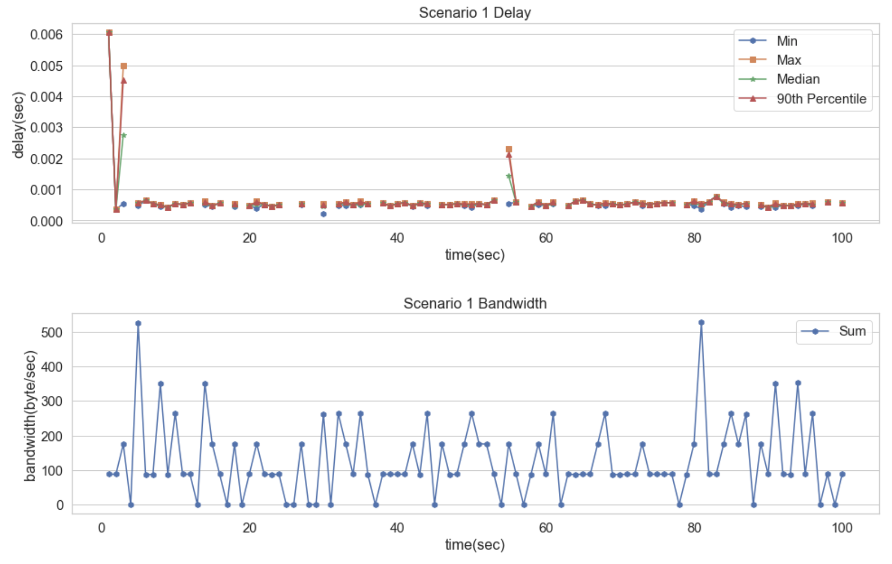
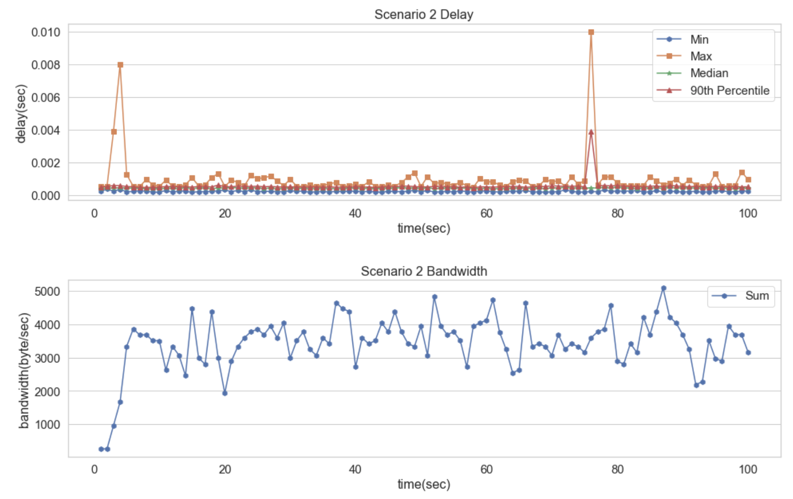

# ECE428
Distributed Systems

# How to Connect
We are group 15.  Replace 01 with any number between 01 and 10.

	ssh [NetID]@sp20-cs425-g15-01.cs.illinois.edu

# What IP to use
Run

	ifconfig

And use the eth0 inet address

	eth0: flags......
		inet 172.22.94.48 netmask 255.255.254.0...
		...

Use the 172.22.94.48 one for central logger (VM number 1). 

# MP0 Instructions

## Command used for clients
Run 

	python3 -u generator.py 0.1 | python3 test-client.py

0.1 represents 0.1 Hz so once every second

Use Ctrl+C to terminate the client.

## Command used for logger
Run

	python3 logger.py <N>

Where N represents the number of nodes we wish to log simultaneously.

Once all N nodes have terminated then we will have N files in the logger directory labeled nodeN.txt.

Each contain logs for each node.  The data format is as follows.

	nodeTime nodeData loggerTime bytesTransfered

Where nodeTime is the time when the msg was generated on the node, nodeData is the data sent, loggerTime is the time which the logger received and parsed the msg, and finally bytesTransfered is the number of bytes that was sent by a particular node.

logger.py will then proceed to generate graphs immediately, there is no reason to actually look at these files.

## Graph Visualization

