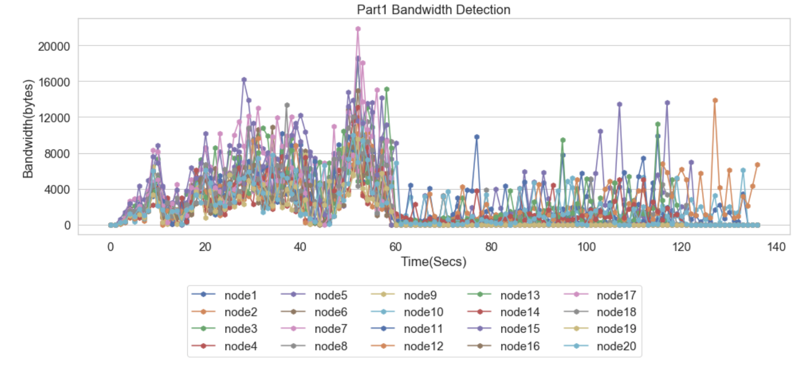
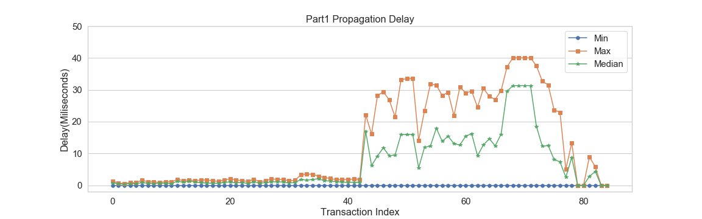
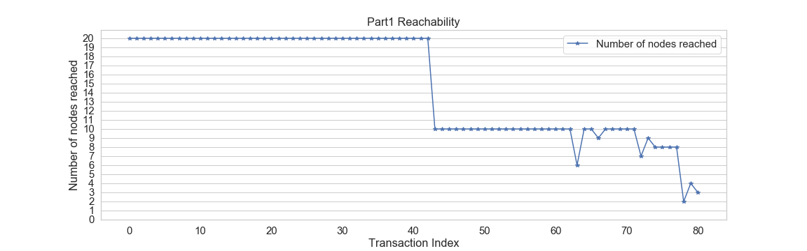
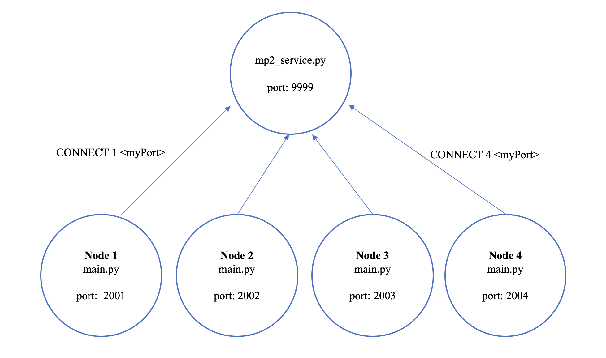
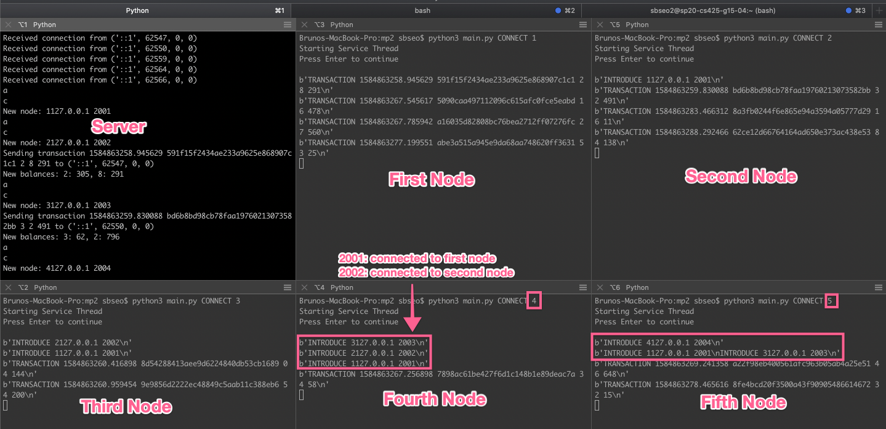
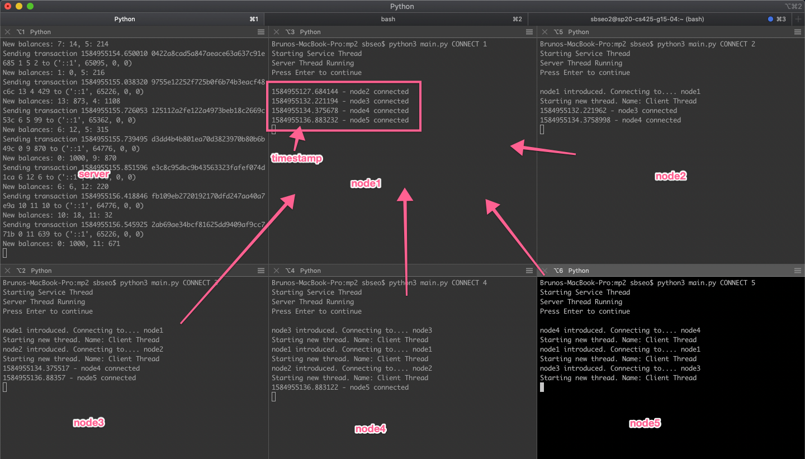
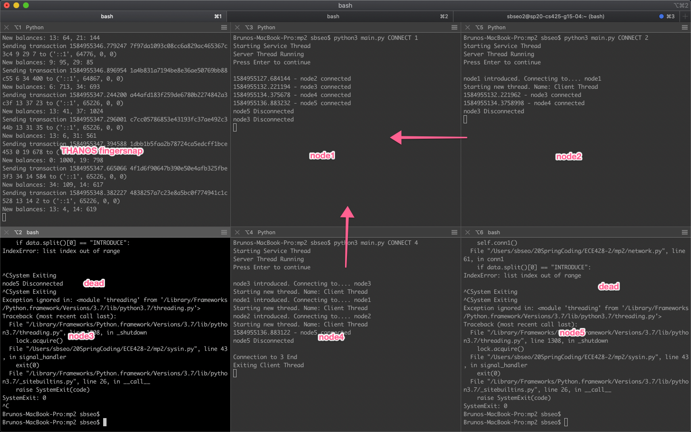
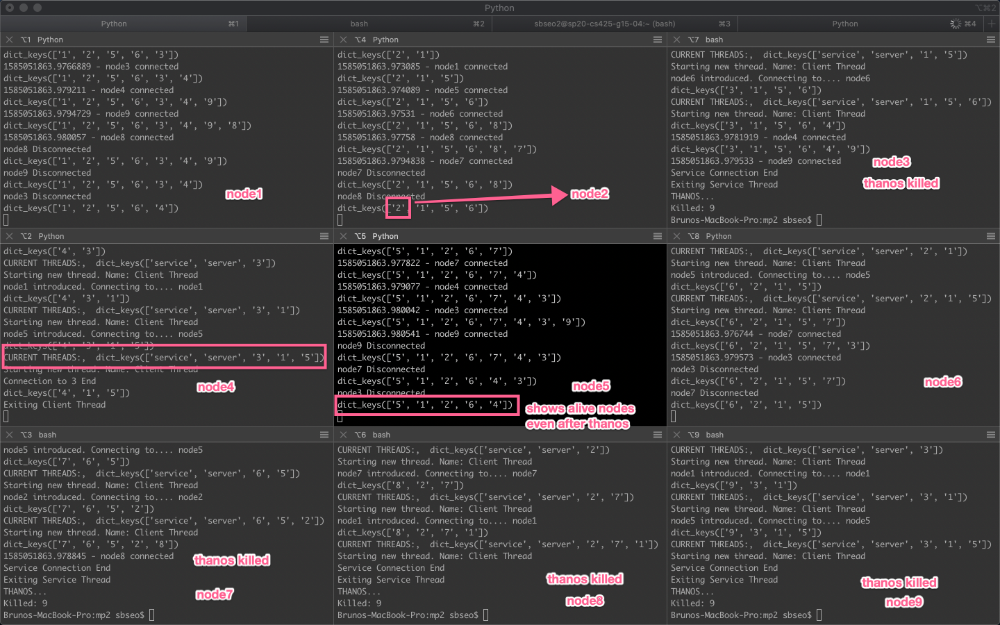

# TODO/UPDATE 4/16/20
## Status

* No more deadlocks!

## TODO

* Verify correctness of distributed log on two nodes

* Deal with proper rebuilding of account balances

* Test with larger block sizes

* Undo balances vs reset completely

# TODO/UPDATE 4/15/20
## Status
Currently the code is able to do the following.

1. Receive transactions create blocks and solve the blocks

2. We are able to gossip blocks between nodes

3. We are able to verify blocks

4. We are able to detect when to switch a branch based upon the block sent to us.  If the block send to us has a higher block height than our current block height we stop mining.

5. We are able to begin requesting blocks that we do not have.  For instance if we are on blockheight 0 and we receive a blockheight of 1, we send block 1 off for verification and request block 0.  We are also able to receive block 0 and send it off for verification as well.

6. Once verified, we are able to move the verified blocks and overwrite our solved dictionary of blocks

## TODO

1. When dealing with verifications, we will double send.  For example, if we have blockheight 1 and 0 in our verification dictionary (where we received 1 first) we will double send blockheight 1.  This occurs because whenever the serviceThread loop runs, we send out verification requests for all the blocks in the toVerify dictionary.  While this does not affect correctness this sends extra messages. (this is a low priority problem)

2. We have yet to be able to request more than one block after detecting.  This means that if we received a block of block height 2, we only request an additional block height of 1.  This will probably be implemented by performing a check when receiving a verification OK.  We will then check the previous hash of any blocks to see if they match. In the case mentioned above, we will have to check if the newly verified block 1 has the previous hash of our currently stored block 0.  If it does not, use a flag to tell the gossipRecv/Send to request the next lower number block height.

3. Currently the implementation of genBlock is incorrect.  While we do check the account balances, we do not have any method of reversing transactions.  This is a problem if we need to rollback transactions by switching chains.  Most likely we will have a temporary account and a finalized account.  The temoprary account will be used to build the next block.  The finalized account will only be updated to blockHeight - 6 transactions.  The rational is that if the blocks are that deep they have been confirmed.

## Other Notes
Everything currently has only been tested on 2 nodes.  Once the following TODOs have been implemented larger scale testing will done subsequently.

# TODO/UPDATE 4/14/20
## TODO
* We probably need to clear gossip messages because we can allow new nodes to just mine a block get turned down and then begin the repair process.
* A way to stop receiving gossiped blocks while we are repairing the chain?
* Deletion of messages from our global list after switching chains
  * Deletion of messages after solved
  * Restoration of messages if we are switching chains (aka stale chain has some tx that are not in new chain yet)
* receivedTransBlock should this be a SET instead of LIST to ensure we dont have duplicate messages?

## Changes
* VERIFY OK is implemented and VERIFY FAIL is implemented !!!UNTESTED

## WIP
* Repair
  * After gossiping PREVHASH if there are other nodes that also want updated blocks we need to block them until we actually fix our own chain first

# TODO/UPDATE 4/14/20
## UPDATE
Overleaf Address 
    
    https://www.overleaf.com/project/5e844353338db60001d64e08

# TODO/UPDATE 4/13/20
* The following functionality has been added
  * We are now able to send SOLVE requests to the service
  * We are now able to receive SOLVED requests from the server
  * We are able to gossip blocks between nodes
  * We are able to VERIFY blocks and receive an OK or FAIL
* The following functionality has yet to be added
  * What to do when we receive a VERIFY OK
    * AKA how do we revert the chain and restore blocks
  * What to do when we receive a VERIFY FAIL
    * AKA do we need to tell the other node to throw away things?
  * How do we prevent extraneous blocks from being produced?
    * AKA how do we stop computation when switching chains?
    * Probably use a flag to stop genBlock from executing
  * How do we remove messages that occur in newly accepted blocks from other nodes
    * AKA how do we remove messages from received list that we now know are in later blocks?

# TODO/UPDATE 4/11/20
## Changes
* Local nodes have been implemented
* We now have an extra parameter when running main.py

      python3 main.py CONNECT <VMnum> <instanceID>

* Instance ID represents the nth process on this specific VM we are running and is 1 indexed.  Meaning that the first proces spawned has instanceID = 1, second is instanceID = 2
* To handle the port problems, we offeset each instance by 2.  This allows us to have port 2000 and 2001 for instance 1, 2002 and 2003 for instance 2.  This is reflected in sysin.py.
* In config.py, there also have been changes made to store our new instance ID number.
* In network.py code has been changed in the following functions
  * gossipRecvHandler's INTRODUCE message has been moved to gossipRecv.  This allows the sender to send a unique message telling us what instance that we have connected to.  This allows for the port number to be acquired and allowing to send back gossiped messages
  * gossipRecv has been edited to take over the job of generating
        
        INTRODUCE -1 IP PORT
    messages.
  * gossipSend now contains a line that sends the following message

        INSTANCEID + str(g.INSTANCEID) + "\n"
  
  this allows us to inform the other node how to calculate the port offsets
* In the sysin.py file each logger has been edited to log in files with the following names.

      node<VMnum>-<instanceID>.txt
      bandwidth_node<VMnum>-<instanceID>.txt
      delay_node<VMnum>-<instanceID>.txt

## Todos
* Please verify for 20 nodes that this still works.  If execution is too slow, comment out more prints.  If performance is still bottlenecked then there may be some possible optimizations such as requiring less threads.

## Things of Note
* When running a total of 6 nodes with 2 nodes per vm, the last 10-15 messages were not received these were still living in the gossip and have yet to be sent out
* I encountered an issue where CTRL+Cing on the service failed to terminate 1/6 of the nodes.  I have not looked into this issue but if you run into it please let me know.  Maybe I pressed the wrong button.  It appeared that the node did not recieve DIE from the service.

# TODO/UPDATE 4/1/20
## UPDATE
* Part 1 is complete!

* Jupyter notebook automatically parses log file and generates graphs.
* Bandwidth is measured by checking the size of received data via receiving ports every one second.
* Propogation delay is measured by tracking every transaction from the beginning node to the end node.
* Reachability is measured by counting the number of each transaction reached at every node after termination.

## TODO
* Current system only allows one connection for a computer. However, we need to allow two connections per computer (We have 10vms, and experiment requires 20 nodes). I'll handle this.
  => I spent whole night but could not fix this issue. While the first local node can receive the second local node's message, it cannot send message back. I suggest not to waste more time on this issue. This won't be even graded. 
* Part2

# TODO/Changes 3/28/20
## Changes
* Gossip now works. Tested 5 nodes on server @ 5 Hz
* Gossip currently prints a bunch of crap if its too much please comment them out
* I have changed the way gossip works a bit please refer to gossipSend/Recv for the changes
* NOTE: I have moved config.gossipMsgs and config.transMsgs out of config.py.  This was not the bug but I thought it was in the beginning so I moved it.  Feel free to move it back if you wish.
* NOTE: An easy way to verify the messages is as follows. Replace the line for printing trasaction/new balance with
	
		print(str(tx_from) + " " + str(tx_to) + " " + str(tx_amount))

	You can also print the timestamp, I did not.  Also, in sysin.py the kill manager has been edited to sort messages and only print, tx_from, tx_to, tx_amount.  Feel free to change these back.  But sorting the messages by their timestamp made it easy to verify that all messages were received in order.

## Todo
* Gossip messages currently have a usesless field.  Previously a message was of the form (msg, socklist).  Now socklist is useless.  While not urgent these should be removed probably for efficiency sake.
* Gossip needs to send remaining messages in queue before termination. gossipSend probably needs to have a flag to check for a DIE message.
* QUIT is still not implemented (they say you can use the same but if you come up with a better idea please implement it)
* Propogation delay measurement, have yet to test what happens with more than 5 nodes or what happens when you kill nodes.
  >> Verified that message is delivered well even after we kill nodes (9nodes @ 1 Hz). Message at the end seems messy, but I think that is normal.
* Part1 ipynb.
  >> Complete

# TODO 3/26/20
* Have yet to verify that ALL messages are able received by all nodes.  Currently gossip is known to be sending to all introduced nodes.
  >> I verified that not ALL messages are recieved by all nodes. Please use node<num>.txt to check this. 
* Have yet to correctly .join() all threads and update thread lists in network.py
* Have yet to add DIE and QUIT functionality
  >> DIE is now implemented. Please type *thanos* in service.py to check this. 
* Have yet to properly add logging functionality
  >> Now, logfile of *receivedTrans* is saved when program ends. eg) node1.txt  
  >> I'll keep tracking other logging parts too
* Probably need heartbeat for later? We can probably use the gossip threads to double as heartbeat threads
  >> I think this won't be neccessary. It is already implemented in TCP implicitly

# Note
When global variables are declared in config.py, it can be accessed from anywhere.    
Therefore, I moved *receivedTrans* to config.py.  Now, it can be accessed by the following.  

    config.receivedTrans

# How to Connect

## Server
1. Kindly type below on your server side

        python3 mp2_service.py < Service_Port > < tx_rate >

Note that you must save your ServicePort. For default, 9999 is suggested for remote setting, while 9998 is suggested for local setting.
tx_rate is the rate at which the service generates transactions.

## Clients
1. Kindly open up your *config.py* file. Please edit below information corresponding to your server setting above. 
    
	    SERVICE_HOST, SERVICE_PORT = 'localhost', 9998

2. Kindly type one the commands below on the client side

        1) python3 main.py CONNECT < myNum >
        2) python3 main.py CONNECT < myIP > < myNum >
 
 Between above two commands, feel free to use whichever you feel comformatable with. The first command implicitly uses its node's ip address. When setting myNum, please use integer to make both development and evalution easier. Example is shown as below.  

    python3 main.py CONNECT 1
    python3 main.py CONNECT 2
    python3 main.py CONNECT 3

When killing a process, please use *ctrl + c* for best result. 

# Progress 

Each node succesfully receives introduce and transaction message

Image above shows how each node is connected to each other. After service.py introduces 3 nodes, clients attempt to connect the introduced server.  

Even when server executes Thanos's finger snap, both server and client nodes can detect their death. The program runs without an error. Massive killing scenario works even with 9 nodes connected each other so far. (Will be working on 20nodes as well)

Now, *NODES (dictionary)* shows alive nodes in the network on screen. It also means the connected nodes with the owner inlcuding the owner itself.  

    dict_keys(['1', '2', '3'])

The first element '1' means the server(owner) node is 1.  
'2' and '3' mean that the server is connected to '2' and '3'.

# Threads
Currently, there are four kinds of threads in this system.

    mainthread: runs in main.py. It is not explicitly defined.  
    thread1: connects to service.py
    thread2: node runs its own server
    thread3: connects to first introduced node

When *thread1* receives INTRODUCTION message from *service.py*, it executes *thread_handler* function.  
*thread_handler* function starts a new thread *thread3*.   
Then *thread3* attempts to connect the introduced node. Depending on each node, the number of *thread3* may vary from 0 to 3.

Threads are saved in *THREADS (dictionary)*. 

    CURRENT THREADS:,  dict_keys(['service', 'server', '6', '5', '1'])

Above example shows that there are service thread, server thread, and three other nodes connected.  
Other nodes who attempts to connect the server all share server thread.  
The nodes that this node attempts to connect are '6', '5', and '1'.

# To-Do List
1) Gossip

# Useful commands
    
    pkill Python

For mac, I found this works well. 

    ps -A | grep main.py

Above command shows whether there are alive processes left. 
