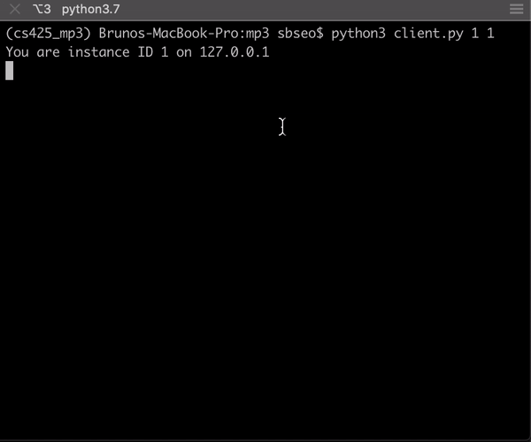

# MP3

Concurrent bank RMI stuff.
Below contains some details and ideas of how to implement the system.

There will be 5 servers A, B, C, D, and E and up to 10 clients.

In order to keep track of concurrency we will be using timestamped concurrency.

## Dependencies

This code uses the Python library Pyro4 please install it via pip

```
	python3 -m pip install Pyro4
```

## Setup

To set up Pyro to work correctly we need to change several global variables.
When starting up coordinator.py or server.py you will see output similar to the following.

```
	Object <class '__main__.Server'>:
    	uri = PYRO:servA@127.0.1.1:9090
	Pyro daemon running.
```

This unique reference ID is what we use to access the functions/objects remotely.

In coordinator.py we need to update the following.

```
	SERV_A_URI = "PYRO:servA@127.0.1.1:9090"
	SERV_B_URI = "PYRO:servB@127.0.1.1:9091"
	SERV_C_URI = "PYRO:servC@127.0.1.1:9092"
	SERV_D_URI = "PYRO:servD@127.0.1.1:9093"
	SERV_E_URI = "PYRO:servE@127.0.1.1:9094"
```

In server.py we need to update the following

```
	COORDINATOR_URI = "PYRO:coordinator@127.0.1.1:8080"
```

In client.py we need to update the following.

```
	SERV_A_URI = "PYRO:servA@127.0.1.1:9090"
	SERV_B_URI = "PYRO:servB@127.0.1.1:9091"
	SERV_C_URI = "PYRO:servC@127.0.1.1:9092"
	SERV_D_URI = "PYRO:servD@127.0.1.1:9093"
	SERV_E_URI = "PYRO:servE@127.0.1.1:9094"
```

## Usage

Below are the parameters required for each file.

coordinator.py
```
	USAGE: python3 coordinator.py <NUM_SERVERS>
	NUM_SERVERS is a number >0 representing the number of servers running
```

server.py
```
	USAGE: python3 server.py <SERV_NAME>
	<SERV_NAME> is A, B, C, D, or E
```

client.py
```
	USAGE: python3 client.py <INSTACE_ID> <NUM_SERVERS>
	We assume that 1 <= NUM_SERVERS <= 5
	If you are using one server please spawn server A
	If you are using two servers please spawn server A and B
	If you are using three servers please spawn server A, B, and C
	If you are using four servers please spawn server A, B, C, and D
	If you are using five servers please spawn server A, B, C, D, and E
```

## TODOs/Dones

### List of test cases

Bruno please come up with more of these please!

1. tested
```
	T0			T1
	write X
				write X
	read X
				ABORT
```

2. tested
```
	T0			T1
	write Y
				write X
	read X
	ABORT			
```

3. tested
```
	T0			T1
	write X
				write X
				COMMIT
				ABORT
```

4. tested (prints commit aborted)
```
	T0			T1
	read Y
	ABORT		write X
```

5. tested
```
	T0			T1
	write Y
				write X
	write X
				ABORT
```

6. tested
```
	T0			T1			T2
	write X
				write X
							write X
	read X
				ABORT
							ABORT
```

7. tested
```
	T0			T1			T2
	write X
				write Y
							write X
	read X
							ABORT
							
```


8. error (T1 overwrites T0)
```
	T0					T1
	BEGIN				BEGIN

	DEPOSIT A.a 100
						BALANCE A.a
						NOT FOUND ABORT

	
```

9. tested
```
	T0			T1			T2
	write X
				read x
				ABORT
				write x

				COMMIT	
```

10. value error (commit after write invokes errors)
```
t0					t1					t2				t3
begin
					begin
										begin
DEPOSIT A.a 100
COMMIT
														BEGIN
														BALANCE A.a
					BALANCE A.a
														DEPOSIT A.a 99
					DEPOSIT A.a 123
														ABORTED
														
```

11.  Large scale testing error (T1 overwrites T0)
```
	T0			T1
	write X
				write X
	
	commit		abort

```

12. Is this a problem? Should both be able to commit?
```
	T0				T1
	BEGIN
					BEGIN
	DEPOSIT A.foo
					DEPOSIT A.foo
	COMMIT			ABORT
	BEGIN
					BEGIN
	BALANCE A.foo
					BALANCE A.foo
	COMMIT			ABORT
```

13. Negative withdraw should fail
```
	T0
	BEGIN
	DEPOSIT A.foo 100
	WITHDRAW A.foo 123
	COMMIT
	ABORT

	BEGIN
	BALANCE A.foo <-- should be None
	ABORT

	BEGIN
	DEPOSIT A.foo 100
	COMMIT

	BEGIN
	WITHDRAW A.foo 50 <-- A now 50
	COMMIT

	BEGIN
	WITHDRAW A.foo 75 <-- Negative should abort
	COMMIT
	ABORT
```

### Dones

* Local 2 clients one server
  * Tested the following cases: 1, 2, 3, 4, 5
* 2 server tests completed
  * Abort
  * Commit
  * No conflict deposits
  * abortNewerTx appears to work
  * Coordinator Commit and abortCommit have been changed to support multiple servers
* Deposit: Will abort automatically if it detects conflict
* Balance: Will abort automatically if it detects conflict
* Commit: Currently set up to abort transaction if it detects that a previous one is still conflicting (does not wait for completion)
* Withdraw: Behaves similary to deposit. Currently not fully tested
* Abort via client

### TODOs

* Max balance needs to be set in the code somewhere
* All server operations when failing need to abort?
* Server abort needs to notify coordinator to kill transaction
* More 1 server 2 client testing
* Remote testing + all 5 servers + 10 clients (or less w/e)
=> pip install is not allowed in our vm clusters. Let's only do the testing in local environment.

* Two consecutive commits do not seem working



## Client

Sends a transaction which could communicate with multiple branches (servers).

Supported commands

* BEGIN: Begin a transaction
* DEPOSIT server.account amount: Deposit an amount of money into a specific account at a server
	* Will receive reply OK when completed
* BALANCE server.account: Check the balance of an account at a specifc server
	* Will receive reply OK when completed
	* Will receive reply NOT FOUND if account does not exist
* WITHDRAW server.account amount: Withdraw money from an account
	* Will receive reply OK when completed
	* Will receive reply NOT FOUND if account does not exist
* COMMIT: Complete and conclude a transaction
* ABORT: A client can use this command to abort a transaction

Some things of note

* The maximum balance of any acount is 1,000,000.
* A DEPOSIT to a new account will create an account.
* A WITHDRAW to a non-existent account will not work.
* DEPOSIT, BALANCE, and WITHDRAW must reside within a BEGIN <-> COMMIT or BEGIN <-> ABORT
* A client should see updates to its tentative transaction even if it will be aborted in the future.
* A client will always send well formed commands
* If a lock is required, the client will receive no response until the lock has been acquired
* A client's transaction may be aborted by the coordinator if it discovers concurrency conflicts

### Implementation Details

Each transaction that is started with a begin must be uniquely identified.
In order to do so, the client must keep a local counter representing their own transaction ID.
This value however does not represent the timestamp that the coordinator uses.
However this value will be attached to each portion of transaction in order for the coordinator to know which transaction each DEPOSIT/WITHDRAW/etc is part of.

For example...

```
	BEGIN (ip,tid)
	DEPOSIT servA.accA 500 (ip,tid)
```

We need this because multiple clients may be using the same branch at the same time.
Therefore a branch may receive multiple ```DEPOSIT servA.accA 500 (ip,tid)``` at the same time.
Doing this allows the branch and consequently the coordinator to know which transaction this command relates to.

These commands should be sent via an RPC.

#### Main Loop

```
	def main():
		connectToAllServers()
		txId = 0
		while True:
			cmd = input()
			type, server, acc, amount = parseCommand(cmd)
			if type == "BEGIN":
				if server == "A":
					serverA.BEGIN(myIp, txId)
				elif server == "B":
					serverB.BEGIN(myIp, txId)
				...
				txId += 1
			elif type == "DEPOSIT":
				...
```

```
	serv.begin(ip,tid)
	serv.deposit(acc, amount, ip, tid)
```

## Coordinator

The coordinator will receive information from each branch.
The job of the coordinator is to keep track of transactions and determine which transactions need to be aborted and if a commit is valid.
Moreover the coordinator needs to keep track of timestamps to maintain the following invariants.

1. Whenever a Transaction T issues a W_item(X) operation, check the following conditions:
	* If R_TS(X) > TS(T) or if W_TS(X) > TS(T), then abort and rollback T and reject the operation. else,
	* Execute W_item(X) operation of T and set W_TS(X) to TS(T).

2. Whenever a Transaction T issues a R_item(X) operation, check the following conditions:
	* If W_TS(X) > TS(T), then abort and reject T and reject the operation, else
	* If W_TS(X) <= TS(T), then execute the R_item(X) operation of T and set R_TS(X) to the larger of TS(T) and current R_TS(X).

If any of these are violated, the coordinator needs to abort the transaction with the largest transaction ID that is causing the conflict.

```
	WRITE X # TID 1
	WRITE X # TID 0
	ABORT TID 1
```

When aborting TID 1, the coordinator will need to send an ABORT command to all branches operating on TID 1 which will in turn notify the client that their transaction has aborted.

### Implementation details

#### Account Timestamp Tracking

For each account in a server we need to keep track of two timestamps per account.
One for the read time stamp and one for the write timestamp.
To do so, we use a dictionary.

```
	# one timestamp dictionary per branch (server)
	tsDict = { "A" : {}, "B" : {}, "C" : {}, "D" : {}, "E" : {}}
	# each branch in tsDict contains another dictionary with
	# key: account ID and a tuple representing the read time stamp
	# and write timestamp
	tsDict["A"] = {acc : (rts, wts)}
```

#### Transaction IDs

We do not use the (ip, tid) tuple sent by the branch to identify transactions.
We will store these (ip,tid) tuples in a list.
The index of the list represents the actual transaction ID used by the timestamp calculations.

For example...

```
	[(ipA, 0), (ipB, 0), (ipB, 1)]
```

Here the tid = 0 is ipA's 0th transaction and tid = 2 is ipB's 1st transaction.

#### coordinatorRead

This function is used to update the read timestamp of an account for a branch.
If the update is not possible we need to abort the transaction.
Otherwise we need to update the value inside the tsDict.

```
	def coordinatorRead(ip, tid, acc):
		tid = tidList.index((ip,tid))
		rTsAcc = tsDict[serverId][acc][rts]
		wTsAcc = tsDict[serverId][acc][wts]
		if (wTsAcc > tid):
			return 0
		else:
			tsDict[serverId][acc][rts] = max(rTsAcc, tid)
			return 1
```

#### coordinatorWrite

This function is used to update the write timestamp of an account for a branch.
If the update is not possible we need to abort the transaction.
Otherwise we need to update the value inside the tsDict

```
	def coordinatorWrite(ip, tid, acc):
		tid = tidList.index((ip,tid))
		rTsAcc = tsDict[serverId][acc][rts]
		wTsAcc = tsDict[serverId][acc][wts]
		if (wTsAcc > tid) or (rTsAcc > tid):
			return 0
		else:
			tsDict[serverId][acc][rts] = max(wTsAcc, tid)
			return 1
```

## Server

A server needs to store locally its accounts and balances.
To acheive this use a local dictionary (final).

The server will require the following functions which execute the command for a client.

* BEGIN
* DEPOSIT
* BALANCE
* WITHDRAW
* COMMIT
* ABORT

In order to ensure that the local dictionary does not get updated until we know it can be committed, we also store a second dictionary (tentative).
This second tentative dictionary will only contain the relevant accounts that are being used in the current transaction.
Each client should have its own tentative dictionary.

The functions above will communicate with the coordinator in order to determine if they have the right to complete the action required.

### Implementation Details

The functions will need to either reply with an OK or a NOT FOUND as mentioned before.

#### Init

Below is the pseudocode for the Init function.
This function is called upon startup and we assume that the coordinator has been started first.

```
	def Init():
		connectCoordinator()
		finalDict = {}
		tentativeDict = {}
		finalDictLock = threading.Lock()
```

#### BEGIN

Below is the pseudocode for the BEGIN function.

```
	def BEGIN(ip, tid):
		coordinatorCreateTx(ip, tid)
```

#### DEPOSIT

Below is the psuedocode for the DEPOSIT function.

```
	def DEPOSIT(ip, tid, acc, amount):
		if coordinatorWrite(ip, tid, acc):
			tentativeDictUpdate(ip, tid, acc, amount)
			return "OK"
		else:
			ABORT(ip, tid)
			reutrn "ABORTED"
```

#### BALANCE

Below is the psuedocode for the BALANCE function.

```
	def BALANCE(ip, tid, acc):
		if coordinatorRead(ip, tid, acc):
			currAmount = finalDict[acc]
			return serverName + "." + accName + " = " + str(currAmount)
		else:
			ABORT(ip, tid)
			return "ABORTED"
```

#### WITHDRAW

Below is the psuedocode for the WITHDRAW function.

```
	def WITHDRAW(ip, tid, acc):
		if coordinatorWrite(ip, tid, acc):
			tentativeDictUpdate(ip, tid, acc, amount)
			return "OK"
		else:
			ABORT(ip, tid)
			return "ABORTED"
```

#### COMMIT

Below is the psuedocode for the COMMIT function.

```
	def COMMIT(ip, tid):
		if coordinatorCommit(ip, tid):
			updateFinalDict(ip, tid)
			return "COMMIT OK"
		else:
			ABORT(ip, tid)
			return "ABORTED"
```

#### ABORT

Below is the psuedocode for the ABORT function.

```
	def ABORT(ip, tid):
		deleteTentativeDict(ip, tid)
		return "ABORTED"
```

#### Account Dictionaries

1. Global dictionary: This stores the finalized account balances.
This needs to be updated atomically.
This means that this needs to be updated only after a COMMIT with a lock.

```
	finalDict = {} # key: account, value: amount
	with finalDictlock:
		for part in tx:
			prevAmount = finalDict[part.acc]
			finalDict.update({part.acc : prevAmount + part.amount})
```

2. Tentative dictionaries: There can be multiple of these.
This needs to be per client that has began a transaction with the branch (server).
This is a dictionary in itself.

```
	tentativeDicts = {}
	# key: (ip, tid), value: {acc : amount}
	tenativeDicts.update({(ip,tid) : {}})
	# receive tentative update
	prevTentTx = tentativeDicts[(ip,tid)]
	tentativeDicts[(ip,tid)].update({acc : prevTentTx[acc] + amount})
```